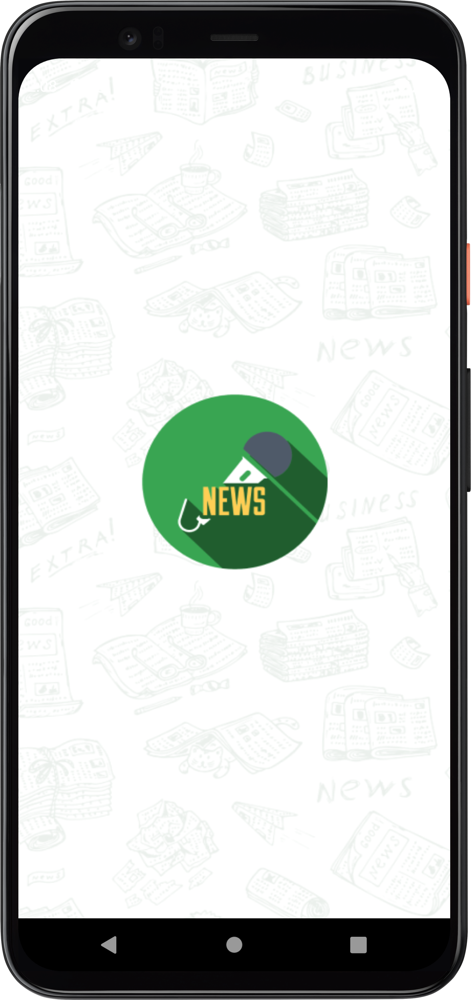
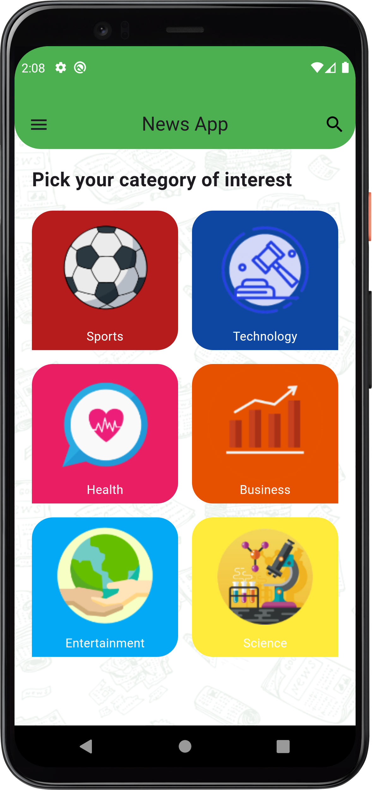
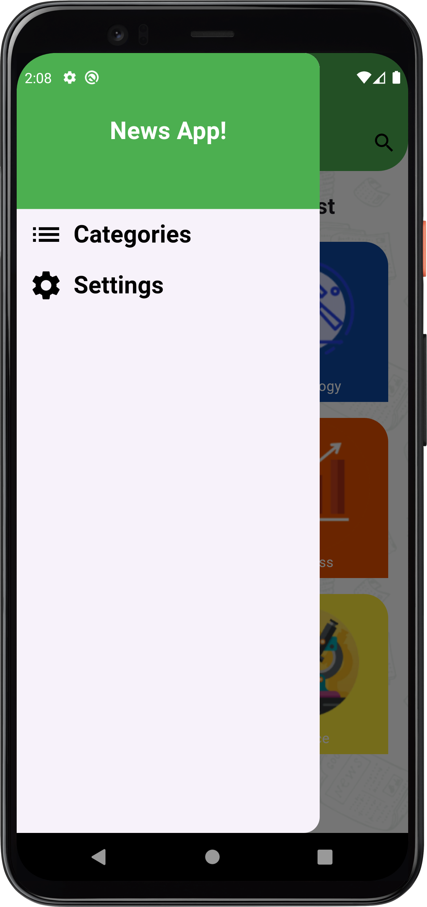
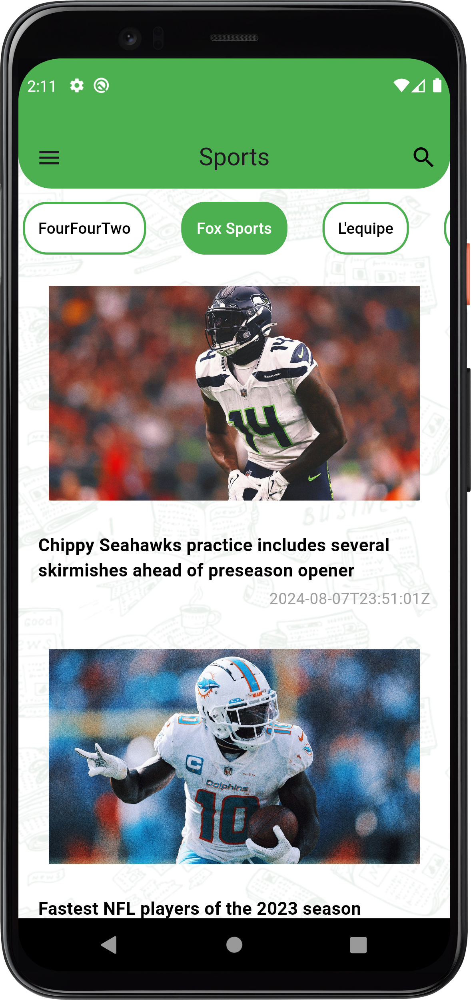
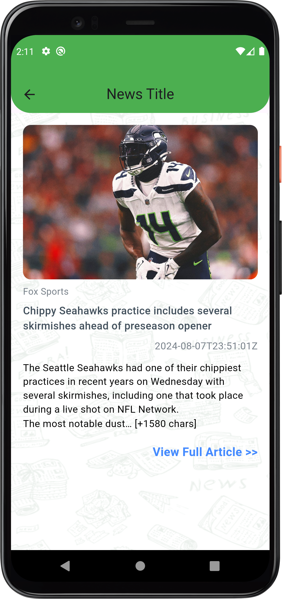
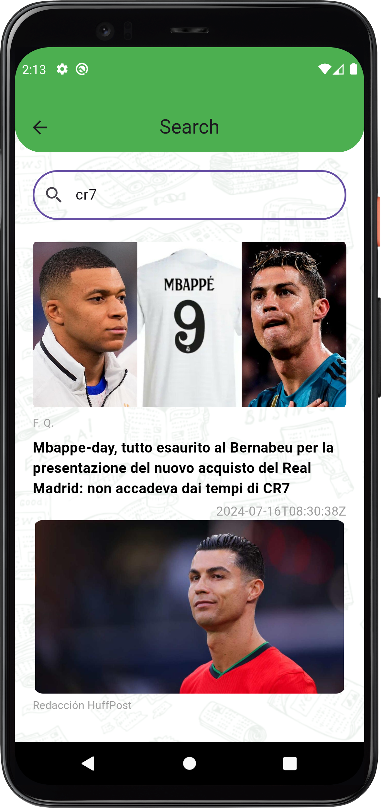

# News App

## Description
The News App is a mobile application built using Flutter that allows users to access news from various sources. The app fetches news data from a news API and displays it to the user. The app also saves the news data offline using the Hive database for offline access and provides the ability to view news articles in a web browser.

## Features
1. News Sources: Users can browse a list of news sources and select the ones they want to follow.
2. News Feed: The app displays the latest news from the user's selected sources.
3. Offline Access: The app saves the news data offline using the Hive database, allowing users to access news even when they are offline.
4. Search: Users can search for news articles by keyword.
5. Web View: Users can view news articles in a web browser within the app.

## Technologies Used
- Flutter
- Dart
- Mvvm
- News Api
- Cubit (for state management)
- Hive (for offline data storage)
- webview_flutter (for in-app web viewing)

## Screenshots
     

    

## Installation
1. Install the Flutter SDK
2. Clone the project repository
3. Obtain an API key from a news API provider (e.g., NewsAPI.org)
4. Add the API key to the project's configuration
5. Install the project dependencies using flutter pub get
6. Run the app using flutter run

## Contributing
If you'd like to contribute to the News App project, please follow these guidelines:
1. Fork the repository.
2. Create a new branch for your feature or bug fix.
3. Make your changes and ensure the code passes all tests.
4. Submit a pull request with a detailed description of your changes.

## Contact
If you have any questions or feedback, please feel free to reach out to the project maintainers:
- Ahmed Mohsen : ahmedmohsen2492@gmail.com

